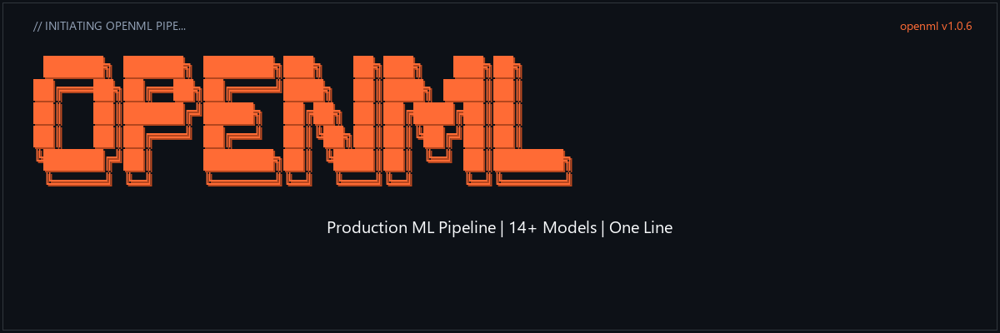

```
 ██████╗ ██████╗ ███████╗███╗   ██╗███╗   ███╗██╗
██╔═══██╗██╔══██╗██╔════╝████╗  ██║████╗ ████║██║
██║   ██║██████╔╝█████╗  ██╔██╗ ██║██╔████╔██║██║
██║   ██║██╔═══╝ ██╔══╝  ██║╚██╗██║██║╚██╔╝██║██║
╚██████╔╝██║     ███████╗██║ ╚████║██║ ╚═╝ ██║███████╗
 ╚═════╝ ╚═╝     ╚══════╝╚═╝  ╚═══╝╚═╝     ╚═╝╚══════╝
```

```
Production ML Pipeline | 14+ Models | One Line
```

<div align="center">

# open-mlpipe

**Data in. Model out. No manual steps between.**

Zero-touch AutoML for tabular data — trains, tunes, evaluates, and saves production-ready models in a single command.

*14+ Models · Auto EDA · Optuna Tuning · SHAP Explainability · Windows-First · Production Ready*

**`pip install open-mlpipe`**

<br>

<!-- Status row -->
[](https://pypi.org/project/open-mlpipe/)
[](https://pypi.org/project/open-mlpipe/)
[](https://pypi.org/project/open-mlpipe/)
[](https://opensource.org/licenses/MIT)
[](https://github.com/yashb/mlpipe/stargazers)
[](https://github.com/yashb/mlpipe/network/members)

<br>

<details>
<summary><strong>Technology and platform details</strong></summary>

<br>


</details>

<br>

**[Quick Start](#-quick-start) · [Pipeline](#-how-it-works) · [Models](#-supported-models) · [Python API](#-python-api) · [CLI](#-cli-usage) · [Config](#-yaml-config) · [Architecture](#-architecture) · [Docs](https://github.com/yashb/mlpipe#readme)**

</div>

---

## Try it in 30 seconds

```bash
pip install open-mlpipe
```

```bash
openml run --data dataset.csv
```

That's it. CSV in, production model out.

**Want it interactive?**

```bash
openml
```

Gives you a REPL: type `run`, pick your dataset, pick your target, watch it go.

---

## How it works

```
Raw CSV → Load → EDA → Clean → Feature Eng → Split → Preprocess
    → Compare 14 Models → Tune → Select → Evaluate → Explain → Save
```

| Stage | What Happens |
|-------|--------------|
| **Load** | Auto-detect CSV/Parquet/Excel, infer task type (regression/classification) |
| **EDA** | Statistical profiling, missing values, outliers, skewness |
| **Clean** | Duplicates, ID columns, low-cardinality, IQR outlier removal |
| **Feature Eng** | Interactions, log transforms, missingness flags, datetime decomposition |
| **Split** | Stratified train/test split with configurable ratio |
| **Preprocess** | Impute, scale, encode — all via ColumnTransformer |
| **Compare** | 14+ models head-to-head with cross-validation |
| **Tune** | Optuna Bayesian hyperparameter optimization with baseline comparison |
| **Select** | SHAP-based feature importance ranking |
| **Evaluate** | R², RMSE, MAE, MAPE, F1, ROC-AUC, MCC, overfitting detection |
| **Explain** | SHAP summary, dependence, and waterfall plots |
| **Save** | Full inference pipeline (feature_eng + model) as joblib |

---

## Terminal preview

https://github.com/yashb/mlpipe/assets/openml-demo.mp4


```
>> load          OK (0.1s)
>> eda           OK (0.2s)
>> clean         OK (0.0s)
>> feature_eng   OK (0.0s)
>> split         OK (0.0s)
>> preprocess    OK (0.0s)
>> compare       OK (25.9s)  — tested 14 models
>> tune          OK (20.2s)  — Optuna 20 trials
>> select        OK (0.0s)
>> evaluate      OK (0.0s)
>> explain       OK (3.3s)
>> save          OK (0.1s)

╭────────────────────────────────── Pipeline Complete ───────────────────────────────────╮
│ Task           REGRESSION                                                               │
│ Target         price                                                                    │
│ Best Model     xgboost                                                                  │
│ Time           52.1s                                                                    │
│ test_r2        0.8474                                                                   │
│ test_rmse      43918.22                                                                 │
│ test_mae       2924.15                                                                  │
╰────────────────────────────────────────────────────────────────────────────────────────╯

Model saved to: artifacts/model_v1.joblib

Full session log: logs/pipeline_run_20260722_143200.log
```

---

## Supported models

| Category | Models |
|----------|--------|
| **Linear** | Ridge, Lasso, ElasticNet, LinearRegression, LogisticRegression |
| **Tree & Ensemble** | DecisionTree, RandomForest, ExtraTrees |
| **Boosting** | XGBoost, LightGBM, GradientBoosting, HistGradientBoosting, AdaBoost |
| **Instance & Probabilistic** | KNN, SVM, NaiveBayes |
| **Ensemble** | Stacking, Voting |

**Auto-selected** based on data characteristics and task type. Each model is tuned with Optuna.

---

## Python API

### Simple — one line

```python
from open_mlpipe import run

ctx = run("dataset.csv", target="price")

print(f"Best model: {ctx.best_model_name}")  # "xgboost"
print(f"Test R²: {ctx.metrics['test_r2']:.4f}")  # 0.8474

# Load saved model
import joblib
model = joblib.load("artifacts/model_v1.joblib")
predictions = model.predict(new_data)
```

### Config-driven

```python
from open_mlpipe import run_config

ctx = run_config("configs/regression.yaml")
```

### Programmatic

```python
from open_mlpipe import PipelineConfig, PipelineRunner
from open_mlpipe.config.resolver import build_level1_config

config = build_level1_config("data.csv", target="price")
config.tuning.enabled = True
config.tuning.n_trials = 50

runner = PipelineRunner(config)
ctx = runner.run()

print(ctx.best_model_name)  # "lightgbm"
print(ctx.metrics["test_r2"])  # 0.8474
```

---

## CLI usage

### Commands

```bash
# Full pipeline — zero-touch
openml run --data dataset.csv

# With target specified
openml run --data dataset.csv --target price

# Config-driven
openml run --config configs/regression.yaml

# EDA only
openml profile --data dataset.csv

# Interactive mode
openml

# View last session output
openml view
```

### Options

```
--data, -d       Path to data file (CSV, Parquet, Excel)
--target, -t     Target column name (auto-detected if not given)
--config, -c     Path to YAML config file
--project, -p    Project name
--deploy         Generate FastAPI + Dockerfile
--n-trials       Number of Optuna trials
--cv             Number of CV folds
--test-size      Test set ratio
```

---

## YAML config

```yaml
project: housing-prices
task: auto
data:
  path: data/housing.csv
  target: price
  test_size: 0.2

model_selection:
  candidates: [lightgbm, xgboost, random_forest, ridge]
  scoring: [r2, neg_mean_absolute_error]
  ranking_primary: r2

tuning:
  enabled: true
  engine: optuna
  n_trials: 50
  timeout: 600

feature_selection:
  enabled: true
  method: shap_importance
  min_importance: 0.01

evaluation:
  explainability: true
  shap_plots: [summary, dependence, waterfall]
```

---

## Architecture

```
open-mlpipe/
├── src/open_mlpipe/
│   ├── cli.py              # CLI entry point (Click + Rich)
│   ├── config/
│   │   ├── schema.py       # Pydantic config models
│   │   ├── resolver.py     # Config resolution + YAML loading
│   │   └── defaults.py     # Auto-detection logic
│   ├── core/
│   │   ├── pipeline.py     # PipelineRunner — orchestrates all stages
│   │   ├── context.py      # PipelineContext — shared state between stages
│   │   ├── stage.py        # Base Stage ABC
│   │   ├── registry.py     # StageRegistry — execution order
│   │   └── defaults.py     # Model defaults + search spaces
│   ├── stages/
│   │   ├── load.py         # Data loading
│   │   ├── eda.py          # Exploratory data analysis
│   │   ├── clean.py        # Data cleaning
│   │   ├── feature_eng.py  # Feature engineering
│   │   ├── split.py        # Train/test split
│   │   ├── preprocess.py   # ColumnTransformer pipeline
│   │   ├── compare.py      # Model comparison (14+ models)
│   │   ├── tune.py         # Optuna hyperparameter tuning
│   │   ├── select.py       # SHAP feature selection
│   │   ├── evaluate.py     # Metrics + overfitting detection
│   │   ├── explain.py      # SHAP explainability plots
│   │   ├── save.py         # Model serialization
│   │   └── deploy.py       # FastAPI + Dockerfile generation
│   ├── utils/
│   │   ├── pager.py        # Built-in cross-platform log viewer
│   │   ├── warning_display.py  # Windows console buffer + warnings
│   │   ├── io.py           # Data loading utilities
│   │   └── typing.py       # Enums (TaskType, ColumnType)
│   └── deploy/             # FastAPI + Docker templates
├── tests/                  # 113 unit tests + integration tests
├── configs/                # 5 example YAML configs
└── pyproject.toml          # Package config
```

---

## Installation

```bash
# Core (minimal)
pip install open-mlpipe

# With CatBoost
pip install open-mlpipe[catboost]

# With MLflow tracking
pip install open-mlpipe[mlflow]

# With deployment (FastAPI + Docker)
pip install open-mlpipe[deploy]

# Everything
pip install open-mlpipe[full]
```

---

## What's new in v1.0.6

- **Built-in interactive pager** — `openml view` opens full session logs with arrow-key scroll, search, and page navigation. No more "open notepad".
- **Pipeline completion auto-offer** — after running a pipeline, press `y` to view full output in the pager immediately.
- **Session path persistence** — `openml view` always finds the last run's log, even across sessions.
- **CLI `view` command** — standalone command for browsing any session log.
- **Cross-platform** — works on Windows (msvcrt), Linux, macOS (termios), and web-based PTYs (OpenCode, VS Code terminal).

---

## Testing

```bash
# Run all tests
pytest tests/

# Run with coverage
pytest tests/ --cov=open_mlpipe
```

**113/113 tests passing** — unit tests for all 14 stages, CLI, config, and utilities.

---

## Contributing

1. Fork the repo
2. Create a feature branch (`git checkout -b feature/my-feature`)
3. Run `ruff check src/open_mlpipe/` — fix any lint
4. Run `pytest tests/` — make sure all 113 tests pass
5. Open a Pull Request

---

## License

MIT License — see [LICENSE](LICENSE) for details.

---

<div align="center">

| Where | Link |
|-------|------|
| **PyPI** | [pypi.org/project/open-mlpipe](https://pypi.org/project/open-mlpipe/) |
| **GitHub** | [github.com/yashb/mlpipe](https://github.com/yashb/mlpipe) |
| **Issues** | [github.com/yashb/mlpipe/issues](https://github.com/yashb/mlpipe/issues) |

<br>

**Built by [Yash Brahmankar](https://github.com/yashb)**

*If this saved you time, star the repo and share it.*

</div>
